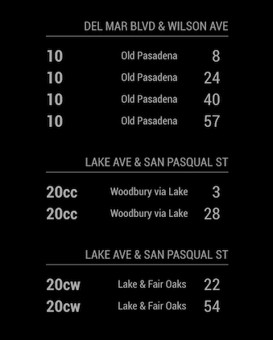
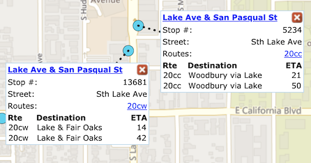

# Module: Pasadena Transit

This [MagicMirror][mm] module shows real-time departures of [Pasadena Transit][pasadena] buses. 
Magic Mirror module for Pasadena Transit information. Real-time Pasadena Transit bus departures.

The module is designed to pull the estimated time of arrival of the bus based on the stop codes provided in the config file. 
Multiple stops can also be added by adding multiple MMM-PasadenaTransit blocks in the config file



## Dependencies

This module requires a list of stop ids and stop names with their corresponding stop_codes 
(shared between LA Metro and other agencies in the LA area). The list is currently contained as a JSON formatted in [stops.json](stops.json).

Should there be any update in the future, this list can be regenerated by downloading [Pasadena Transit's 
static GTFS feed][gtfsfeed], copy stops.txt to same directory then run
```bash
node gen_stops_dict.js
```

## Installation

Go to your MagicMirror's Module directory: 
```bash
cd ~/MagicMirror/modules
```
Clone this repository:
```bash
git clone https://github.com/pbuabthong/MMM-PasadenaTransit.git
```
Install npm packages:
```bash
cd MMM-PasadenaTransit
node install
```

## Using the module

First, add the following to the modules array in the `config/config.js` file: 
```js
modules: [
    {
        module: 'MMM-PasadenaTransit',
        position: 'top_right', // This can be any of the regions.
        config: {
            stopCode: [your stop code #1],
        }
    }, 
    {
        module: 'MMM-PasadenaTransit',
        position: 'top_right', // This can be any of the regions.
        config: {
            stopCode: [your stop code #2],
        }
    }
]
```

## Stop code
The stop codes can be looked up either via Google Maps or [http://rt.pasadenatransit.net/rtt/public/][stoplookup]
(the code is shared with LA Metro and other agencies in LA Metro area). 

Note that currently, the stops on the opposite side of the street have different stop_codes. 
If you want the modules to show buses from both direction, please create another config 
with the stop_code of the opposite stop

### Example
The following shows an example config file for showing the ETAs of buses from both directions 
at the intersection of Lake Ave & San Pasqual St
```js
modules: [
    {
        module: 'MMM-PasadenaTransit',
        position: 'top_right',
        config: {
            stopCode: 13681 ,
        }
    }, 
    {
        module: 'MMM-PasadenaTransit',
        position: 'top_right',
        config: {
            stopCode: 5234,
        }
    }
]
```




## Configuration options
Option|Description
------|-----------
`stopCode`|stop_code (shown as 'Stop #' in [Pasadena Transit map][stoplookup] A.<br/>**Expected Value type:** `int`.
`updateInterval`|Time between updates, in seconds. To protect API abuse, this module automatically limits this value to a minimum of `10`.<br/>**Expected Value type:** `int`.

## Planned Features
- [x] Support multiple stops
- [ ] Shows both direction from a single intersection (the stop code of the opposite stops is already in [stops.json](stops.json)

[mm]: https://github.com/MichMich/MagicMirror
[pasadena]: https://www.cityofpasadena.net/pasadena-transit/
[gtfsfeed]: http://rt.pasadenatransit.net/rtt/public/utility/gtfs.aspx
[stoplookup]: http://rt.pasadenatransit.net/rtt/public/
